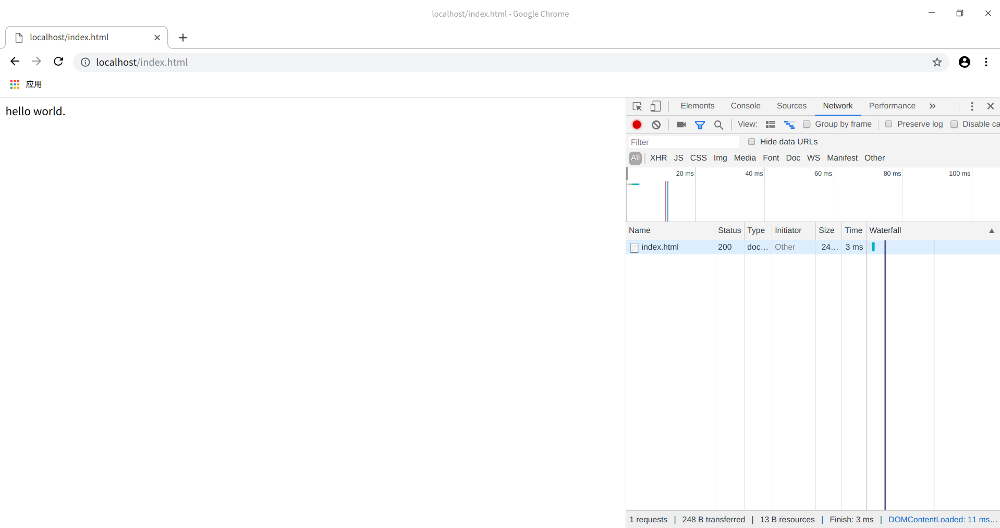
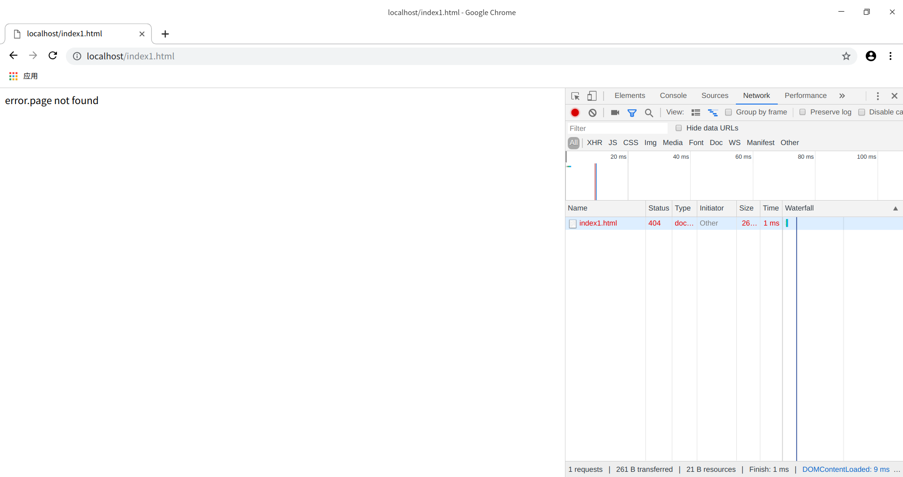

# 多网卡服务器

一般情况下，生产环境的服务器会有多张网卡，有些网卡是非业务网卡，为了给网卡减小负荷，我们就不能给这些网卡配置http服务。

例：

| 网卡 | IP |
|--------|--------|
|      eth0 |  10.20.0.2      |
|eth1|192.168.1.2|
|eth2|172.18.0.2|

eth1和eth2是业务网卡，都需要配置上http服务，eth3是内网认证网络，无需配置http网络，那么在server块添加

```
listen 10.20.0.2:80
listen 192.168.1.2:80
```

尝试访问服务。发现前两个地址都能访问到，但是第三个网络无法访问。

**这种配置叫监听，就是让服务守候在指定IP的指定端口，有请求就对这个请求做出相应的应答。**

# 虚拟主机

再云主机提供商会发现有一项业务就是云虚拟主机。这并非是一个服务器，这个是通过服务器软件模拟出来的一个主机，用以提供http服务。

再nginx中，server块就是一个虚拟主机。一个nginx可以有多个虚拟主机。

# server_name

服务名称，通常是绑定域名。

http服务的响应方式是客户先发起一个请求，即访问域名，DNS服务器做域名解析后指向服务器，访问到服务器。在访问的过程中，浏览器会生成一个报文，报头包含了访问的域名，即server_name，传送到服务器后背服务进行请求转发，转发到指定的server_name。

server_name可以绑定多个域名，使用空格并列排布。

有时候会出现*.test.com的解析。这个*是通配符，通配所有字符串。使用这样的解析的前提是必须再域名解析里也添加一个记录值为*的A解析。


# location块

location块即使本地块，绑定一些本地配置，如网页文件、代理等。

## 前置知识

URL和URI是一个很常用的技术名词。URL是外部资源链接，比如http://www.hzlslm.org.cn/index.html，这就是一个URL。URI是内部资源链接，就是后边的index.html。

## 使用方法

通常在location上定义URI，再location内部定义资源。

```
location /
{
	root /var/www/html;
    index index.html;
}
```

上边的URI是/，那么就是说，URI指向的是网站根目录。在根目录下的解析默认主页是index.html，那么访问网站默认打开的页面就是index.html。

还有这样的定义

```
location /test/
{
	alias /root/test;
}
```

这个URI指向的是test文件夹。下边写了一个alias。在linux中的alias就是重定义的意思，这里也是。这里表示访问test文件夹的时候指向/root/test目录获取资源。

**注意：默认情况下，nginx的运行账户是www-data，不是root，没有最高权限，所以一些文件不能直接访问，这里有两个解决方案：
1.将nginx的user改成root（不推荐，被攻击破解后可能会使服务器造成威胁）
2.添加一个账户，将nginx的user设置成这个账户，资源放到这个账户能直接访问的位置。
**

## 特殊需求

一般生产环节中，比如404或者403报错都会自定义页面，一般情况开发会再程序层面进行定义，如果他们没有定义，那就需要再服务器上定义。

在server块中写
```
error_page 404 404.html
```
这样就可以访问到自定义的错误页了。

# 墙

再国内的程序员都知道，好多国外网站都是无法访问的，那就是因为有一道“墙”。在服务端也可以使用这样的墙。

在location块中添加deny和allow可以进行IP屏蔽。




