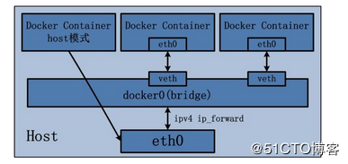

docker网络默认时使用NAT模式的，结构图如下



这张图上有两种模式。第一个容器是host模式，该容器的的IP和主机是相同的，和主机共享网络。第二个是bridge模式。

主要说一下bridge模式。

在docker内部，软件会生成一个虚拟网关，形成一个虚拟的网络。容器分配的IP是这个虚拟网关分配的。外网无法访问，除非在创建容器的时候创建端口映射。

# 查看docker网络

```bash
docker network ls
NETWORK ID          NAME                DRIVER              SCOPE
194c884755b2        bridge              bridge              local
ee717ffaa64f        host                host                local
f39060423673        none                null                local
```

上边是docker的三种网络模式。

在主机上执行ip add命令可以发现一条信息：

```
3: docker0: <BROADCAST,MULTICAST,UP,LOWER_UP> mtu 1500 qdisc noqueue state UP group default
    link/ether 02:42:98:a4:a1:70 brd ff:ff:ff:ff:ff:ff
    inet 172.17.0.1/16 scope global docker0
       valid_lft forever preferred_lft forever
    inet6 fe80::42:98ff:fea4:a170/64 scope link
       valid_lft forever preferred_lft forever
```

这是docker创建的虚拟网卡，这里以虚拟网卡为网关。

## bridge通信原理

容器将数据发送到虚拟网卡上，然后通过虚拟网卡发送出去。外网访问也是同理。

# 端口映射

因为有虚拟网络存在，所以外网因为有内网隔离无法访问到容器。我们需要添加端口映射。

```bash
docker run -itd -p 主机端口:容器端口 image_id
```

这样的话外网就可以访问到相应的端口了。

也可所以使用-P参数，就是随机分配端口。

# 容器互联

创建容器时添加--link参数，在新容器的hosts文件添加原容器的解析。

