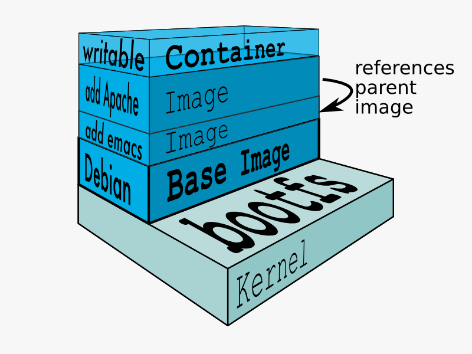

> 镜像是被封装好的服务，镜像可以随时调用，方便进行部署。镜像可以是docker hub上的，也可以是自己封装的。

咱们看一下系统镜像的组成



可以认为镜像都是多镜像叠加起来的。

咱们要部署环境，第一件事就是查找相关镜像。

```bash
docker search image_name:tag
```

系统会返回相关的镜像信息，咱们以centos为例：

```
[root@server etc]# docker search centos
INDEX       NAME                                         DESCRIPTION                                     STARS     OFFICIAL   AUTOMATED
docker.io   docker.io/centos                             The official build of CentOS.                   5703      [OK]
docker.io   docker.io/ansible/centos7-ansible            Ansible on Centos7                              126                  [OK]
```

看一下返回的东西。INDEX是镜像库，NAME是镜像名，DESCRIPTION是镜像简介，OFFICIAL表示是否官方镜像，AUTOMATED表示自动部署。

咱们再看看搜索命令，image_name后有tag，一般情况下，tag表示的是镜像的版本，但是也有其他的用途。

获取到镜像信息了，咱们可以拉取镜像了：

```bash
docker pull image_name:tag
```

咱们再这里发现，拉取镜像的时候有多个拉取进度条，这就可以说明，镜像是多个镜像叠加成的。

拉取镜像和查询镜像的时候，可以不要tag。如果不要tag的话，那就是拉取最新的镜像，及默认latest。

拉取镜像到本地后，咱们可以查看以下本地的镜像：

```bash
bash# docker images
REPOSITORY          TAG                 IMAGE ID            CREATED             SIZE
docker.io/centos    latest              0f3e07c0138f        2 months ago        220 MB
```

看看这个列表。

REPOSITORY表示镜像来源，TAG表示镜像的标签。

IMAGE ID这个参数很重要。每个镜像都会分配一个image id，且唯一。这个image id是拉取镜像的时候系统给分配的。所以再docker hub上是没有分配image id的。

CREATED表示拉取镜像的时间，是拉取镜像到现在的时长。SIZE表示镜像的大小。

**咱们看看这个SIZE。一个完整的centos大概需要6G左右，但是这里只有200M左右，且能完成基本的服务功能。这就体现出了容器化相对于虚拟化的优越性了。**

运行以下镜像吧：

```bash
docker run -itd 0f3e07c0138f
```

镜像这样就运行起来了，咱们看一下状态。

```bash
bash# docker ps -a
CONTAINER ID        IMAGE               COMMAND             CREATED             STATUS              PORTS               NAMES
d24f69f87efb        0f3e07c0138f        "/bin/bash"         4 seconds ago       Up 2 seconds  
```

运行成功。