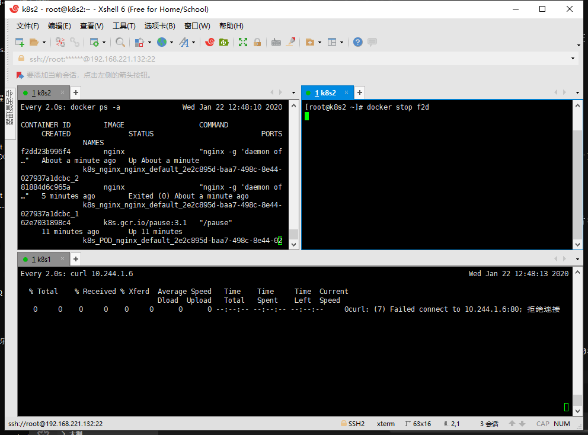

# Pod状态

Pending：正在下载镜像，容器未启动。

Running：镜像正常运行。

Succeeded：容器内指令执行完成，容器不会被重启。

Failed：容器运行出现错误。

Unknown：未知的容器状态。

# Pod重启策略

Always：默认。容器失败自动重启。

OnFailure：容器终止运行，自动重启。

Never：不关注容器状态直接重启。

# 存活检测（LivenessProbe）

k8s中提供了三种容器生存检测，分别是文件检测、TCP检测、HTTP检测

## 文件检测

使用命令检测容器内的文件是否存在，不存在则重新创建容器。

```
livenessProbe:
      exec:
        command:
          - cat
          - /tmp/health
        initialDelaySeconds: 15  #初次探视时间
        timeoutSeconds: 1  #任务超时
```

## 端口检测

使用容器的端口访问确定容器是否活着。

```yaml
livenessProbe:
    tcpSocket:
        port: 80
    initialDelaySeconds: 30
    timeoutSeconds: 1
```

使用了TCP Socket套字检测，如果80套字挂掉了，就重新创建容器。



## HTTP检测

kubelet向容器发送http请求，以确定容器是否存活。

```yaml
livenessProbe:
    httpGet:
        path: /.....
        port: 80
    initialDelaySeconds: 30
    timeoutSeconds: 1
```

第一种检测方式较为常用，适合用于所有服务，后两种只适合用在web服务。

